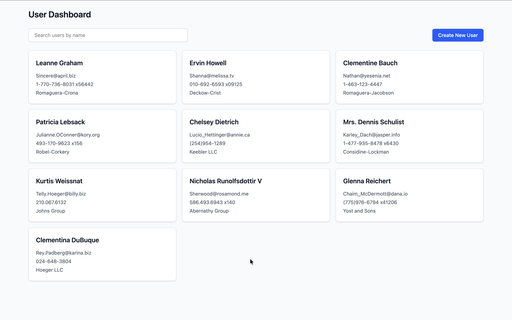
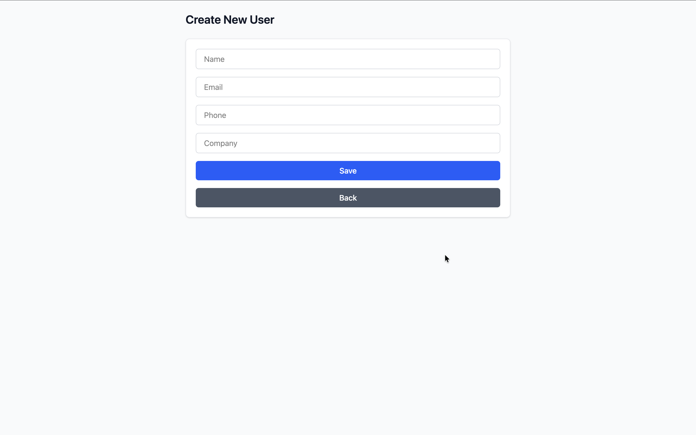
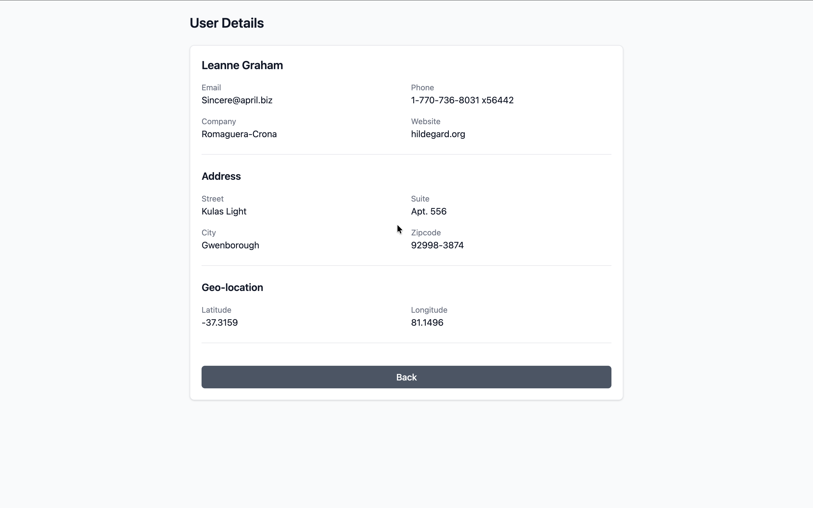

# User Dashboard - Frontend

A responsive User Dashboard application built with React.js as part of the User Dashboard Developer Assignment.

## Features

- Fetch and display users from the API
- Display user name, email, phone, and company name
- Responsive user card layout
- Search and filter users by name
- Debounced user search
- Create new users on the client side
- View complete user details
- Display user address and geo-location
- Handle missing user details with fallback values
- Persist users in local storage across browser refreshes
- Responsive design for desktop, tablet, and mobile
- Global state management using Redux Toolkit
- Client-side routing using React Router DOM
- Feature-based project structure
- Centralized API client and route constants
- Reusable shared UI components
- Reusable custom hooks

## Tech Stack

- React.js
- Vite
- JavaScript
- React Redux
- Redux Toolkit
- React Router DOM
- Axios
- Tailwind CSS

## Project Structure

    src/
    ├── app/
    │   ├── constants/
    │   │   └── routes.js
    │   ├── routes/
    │   │   └── AppRoutes.jsx
    │   └── store/
    │       └── index.js
    │
    ├── features/
    │   └── users/
    │       ├── components/
    │       │   ├── UserCard.jsx
    │       │   ├── UserList.jsx
    │       │   ├── UserSearch.jsx
    │       │   └── UserForm.jsx
    │       │
    │       ├── hooks/
    │       │   └── useUsers.js
    │       │
    │       ├── pages/
    │       │   ├── UsersDashboardPage.jsx
    │       │   ├── CreateUserPage.jsx
    │       │   └── UserDetailsPage.jsx
    │       │
    │       ├── services/
    │       │   └── userService.js
    │       │
    │       └── store/
    │           └── usersSlice.js
    │
    ├── shared/
    │   ├── components/
    │   │   ├── Input.jsx
    │   │   ├── Button.jsx
    │   │   └── Message.jsx
    │   │
    │   └── hooks/
    │       └── useDebounce.js
    │
    ├── lib/
    │   └── api/
    │       └── apiClient.js
    │
    └── main.jsx

## Architecture

The frontend follows a feature-driven architecture where functionality is organized by feature rather than by technical layer based alone.

### `app`

Contains application-level configuration and setup.

- `constants` — Application-wide constants such as route definitions
- `routes` — React Router configuration
- `store` — Global Redux store configuration

### `features/users`

Contains all functionality related to the Users feature.

#### `components`

Contains presentation-focused UI components specific to the Users feature.

- `UserCard` — Displays an individual user
- `UserList` — Displays the collection of users
- `UserSearch` — Handles the search input UI
- `UserForm` — Handles the create-user form UI

#### `hooks`

Contains Users-specific custom hooks and business logic.

`useUsers` is responsible for:

- Accessing Users state from Redux
- Fetching users
- Creating users
- Managing search state
- Filtering users
- Handling Users-related navigation
- Providing handlers required by the Users pages

This keeps the Users pages focused primarily on UI composition and rendering.

#### `pages`

Contains route-level pages.

- `UsersDashboardPage` — Main users dashboard
- `CreateUserPage` — Client-side user creation page
- `UserDetailsPage` — Displays complete user information

#### `services`

Contains API-related functionality for the Users feature.

#### `store`

Contains the Redux slice responsible for managing Users state.

### `shared/`

Contains reusable components and hooks that are not specific to the Users feature.

#### `components`

- `Input` — Reusable input field component
- `Button` — Reusable button component with support for variants and custom styles
- `Message` — Reusable centered message component for loading, error, and not-found states

#### `hooks`

- `useDebounce` — Reusable hook for debouncing rapidly changing values such as search input

### `lib/`

Contains reusable application-level utilities such as the centralized Axios API client.

## API

During frontend development, the application uses the JSONPlaceholder Users API:

<https://jsonplaceholder.typicode.com/users>

The API service is separated from the presentation layer to keep API communication independent from the UI components.

The API is currently used for fetching existing users.

User creation is intentionally handled entirely on the client side according to the assignment requirements.

## Getting Started

### Prerequisites

Make sure the following are installed:

- Node.js
- npm

### Installation

Navigate to the Frontend directory:

    cd Frontend

Install the project dependencies:

    npm install

### Start Development Server

    npm run dev

Vite will display the local development URL in the terminal.

### Build for Production

    npm run build

### Preview Production Build

    npm run preview

## Application Routes

| Route | Description |
| --- | --- |
| `/` | Redirects to the Users Dashboard |
| `/users` | Displays the Users Dashboard |
| `/users/create` | Displays the Create New User form |
| `/users/:userId` | Displays User Details |

## Application Flow

### Users Dashboard

    Users Dashboard
          │
          ├── Fetch users from API
          │       ↓
          │   Redux Store
          │       ↓
          │   Persist users
          │       ↓
          │   localStorage
          │
          ├── Search users by name
          │       ↓
          │   Debounced Search
          │       ↓
          │   Filter Users
          │
          ├── Select a user
          │       ↓
          │   User Details
          │
          └── Create New User
                  ↓
           Create User Page
                  ↓
              User Form
                  ↓
           Redux addUser action
                  ↓
              Redux Store
                  ↓
             localStorage
                  ↓
           Users Dashboard

### User Details

Selecting a user from the dashboard navigates to the user's details page.

The details page displays:

- Name
- Email
- Phone
- Company
- Website
- Street
- Suite
- City
- Zipcode
- Latitude
- Longitude

Missing address or geo-location values are handled with fallback values instead of causing the page to fail.

Users are persisted in local storage so that the Users state is restored after a browser refresh.

### Create User

The Create New User flow is handled entirely on the client side, as required by the assignment.

Users can navigate to the Create New User page from the dashboard and submit the form with:

- Name
- Email
- Phone
- Company

The newly created user is added to the global Redux state and persisted in local storage.

    Create New User
           ↓
    Create User Page
           ↓
        User Form
           ↓
    Redux addUser action
           ↓
       Redux Store
           ↓
       localStorage
           ↓
    Users Dashboard

## State Management

Redux Toolkit is used to maintain the Users data globally.

The Users slice manages:

- Users collection
- Loading status
- Error state
- Fetching users
- Adding users on the client side

The Users collection is persisted in browser local storage so that users remain available after a browser refresh.

The feature-specific `useUsers` custom hook provides access to Users state and encapsulates Users-related business logic and handlers.

This keeps Redux interaction and Users-specific logic separate from the presentation components.

## Search and Debouncing

The dashboard supports searching users by name.

Search state and filtering logic are handled inside the `useUsers` custom hook.

A reusable `useDebounce` hook is used to delay filtering until the user has stopped typing for a short period.

    User types
        ↓
    Search state
        ↓
    useDebounce
        ↓
    Debounced search value
        ↓
    Filter users
        ↓
    User List

This keeps the search behavior responsive while avoiding unnecessary filtering operations during rapid typing.

## Routing

React Router DOM is used for client-side navigation.

The application uses:

- `createBrowserRouter`
- `RouterProvider`

Routes are maintained through centralized route constants to avoid repeating static route strings throughout the application.

## Reusable Components

Shared UI components are maintained under:

    src/shared/components/

### Input

The `Input` component provides a reusable input field for forms and accepts custom properties required by different form fields.

### Button

The `Button` component provides reusable button styling and behavior across the application.

It supports:

- Primary and secondary variants
- Custom styles through the `className` prop
- Reusable button content and actions

The shared `Button` component is used for actions such as:

- Create New User
- Save
- Back

### Message

The `Message` component provides a consistent centered layout for page-level status messages.

It is used for:

- Loading states
- Error states
- User not found states

This prevents repeated status-message layout and styling across different pages.

## Data Persistence

The Users collection is stored in browser local storage.

This prevents the Redux Users state from being lost when the browser page is refreshed.

The persistence flow is:

    Redux Users State
           ↓
      localStorage
           ↓
      Browser Refresh
           ↓
      Restore Users
           ↓
      User Details

Only the Users collection is persisted. Transient request states such as loading status and error state are not treated as persistent data.

## Responsive Design

The application uses Tailwind CSS responsive utilities to support:

- Desktop
- Tablet
- Mobile

Responsive behavior includes:

- Responsive user card grid
- Responsive dashboard controls
- Responsive create-user form
- Responsive user details layout
- Mobile-friendly spacing and sizing
- Responsive action buttons

## Error and Loading States

The application handles the following states:

- Loading state while users are being fetched
- API error state when fetching users fails
- User not found state when the requested user is unavailable
- Empty user results when the search does not match any users

Loading, error, and not-found messages are displayed using the shared `Message` component and centered on the page for consistent UI behavior.

## Screenshots

### Users Dashboard

### Create New User

### User Details

## Development Notes

The frontend uses JSONPlaceholder as a temporary API source for fetching users during development.

The Create New User functionality is intentionally handled entirely on the client side, as required by the assignment.

Users are persisted in browser local storage to retain the client-side Users state across browser refreshes.